### Languages:

    
    
    
    
    
    
    
    
    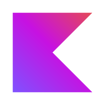

### Awesome Tools:

    
    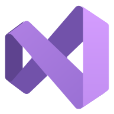
    
    
     
    
    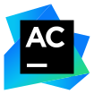
    
    
    
    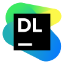
    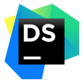
    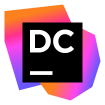
    
    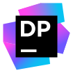
    
    
    
    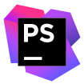
    
    
    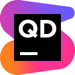
    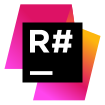
    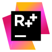
    
    
    
    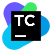
    
    
    

